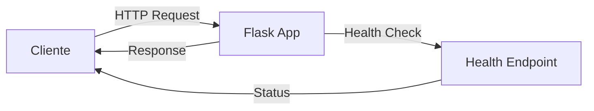

# 🐍 Python App - Documentação

> **Projeto de Teste**: Este é um projeto experimental criado para testar a integração do Backstage com componentes Python e pipelines CI/CD.

---

## 📋 Índice

- [Visão Geral](#visão-geral)
- [Características](#características)
- [Arquitetura](#arquitetura)
- [Instalação](#instalação)
- [Uso](#uso)
- [API Reference](#api-reference)
- [CI/CD](#cicd)
- [Troubleshooting](#troubleshooting)
- [Contribuindo](#contribuindo)

---

## 🎯 Visão Geral

Este projeto é uma aplicação Python simples desenvolvida com **Flask** para demonstrar a integração com o Backstage. O objetivo principal é testar:

- ✅ Registro de componentes no Backstage
- ✅ Integração com GitHub Actions
- ✅ Documentação técnica
- ✅ Health checks e monitoramento

### Informações do Projeto

| Propriedade | Valor |
|------------|-------|
| **Tipo** | Service |
| **Linguagem** | Python 3.11+ |
| **Framework** | Flask 3.0.0 |
| **Status** | 🟢 Experimental |
| **Owner** | DevOps Team |

---

## ✨ Características

- 🚀 API REST simples e eficiente
- 💚 Endpoint de health check
- 🔄 Integração com CI/CD via GitHub Actions
- 📊 Monitoramento básico
- 🧪 Pronto para testes

---

## 🏗️ Arquitetura

### Estrutura do Projeto

```
backstage-test/
├── app.py                 # Aplicação principal
├── requirements.txt       # Dependências Python
├── catalog-info.yaml      # Metadata do Backstage
├── .github/
│   └── workflows/
│       └── ci.yml         # Pipeline CI/CD
├── docs/
│   └── index.md          # Esta documentação
└── README.md             # Documentação rápida
```

### Fluxo de Dados



### Componentes

1. **Flask Application** (`app.py`)
   - Gerencia rotas HTTP
   - Retorna respostas JSON
   - Health check endpoint

2. **CI/CD Pipeline** (`.github/workflows/ci.yml`)
   - Testes automatizados
   - Linting
   - Validação de build

---

## 📦 Instalação

### Pré-requisitos

- Python 3.11 ou superior
- pip (gerenciador de pacotes Python)
- Git

### Passo a Passo

#### 1. Clone o repositório

```bash
git clone https://github.com/rhenriquep/backstage-test.git
cd backstage-test
```

#### 2. Crie um ambiente virtual (recomendado)

```bash
# Linux/Mac
python3 -m venv venv
source venv/bin/activate

# Windows
python -m venv venv
venv\Scripts\activate
```

#### 3. Instale as dependências

```bash
pip install --upgrade pip
pip install -r requirements.txt
```

#### 4. Verifique a instalação

```bash
python --version
pip list
```

---

## 🚀 Uso

### Executando Localmente

#### Modo Desenvolvimento

```bash
python app.py
```

A aplicação estará disponível em: `http://localhost:5000`

#### Modo Produção (com Gunicorn)

```bash
pip install gunicorn
gunicorn -w 4 -b 0.0.0.0:5000 app:app
```

### Variáveis de Ambiente

| Variável | Descrição | Padrão |
|----------|-----------|--------|
| `PORT` | Porta do servidor | `5000` |
| `FLASK_ENV` | Ambiente Flask | `development` |

Exemplo:

```bash
export PORT=8080
python app.py
```

### Testando os Endpoints

#### Usando curl

```bash
# Endpoint principal
curl http://localhost:5000/

# Health check
curl http://localhost:5000/health
```

#### Usando Python

```python
import requests

response = requests.get('http://localhost:5000/')
print(response.json())

health = requests.get('http://localhost:5000/health')
print(health.json())
```

---

## 📚 API Reference

### Endpoints

#### `GET /`

Retorna uma mensagem de saudação e informações básicas do serviço.

**Request:**
```http
GET / HTTP/1.1
Host: localhost:5000
```

**Response:**
```json
{
  "message": "Hello from Python App!",
  "status": "running",
  "version": "1.0.0"
}
```

**Status Codes:**
- `200 OK` - Sucesso

---

#### `GET /health`

Endpoint de health check para monitoramento.

**Request:**
```http
GET /health HTTP/1.1
Host: localhost:5000
```

**Response:**
```json
{
  "status": "healthy",
  "service": "python-app"
}
```

**Status Codes:**
- `200 OK` - Serviço saudável

---

## 🔄 CI/CD

### GitHub Actions Workflow

O projeto inclui uma pipeline automatizada que executa:

1. **Checkout do código**
2. **Setup do Python 3.11**
3. **Instalação de dependências**
4. **Execução de testes** (se existirem)
5. **Linting com flake8**
6. **Validação de startup**

### Visualizando o Workflow

Acesse: `https://github.com/rhenriquep/backstage-test/actions`

### Status Badge

Adicione ao seu README:

```markdown

```

---

## 🔧 Troubleshooting

### Problemas Comuns

#### ❌ Porta já em uso

**Erro:**
```
OSError: [Errno 98] Address already in use
```

**Solução:**
```bash
# Encontre o processo usando a porta
lsof -i :5000

# Mate o processo ou use outra porta
export PORT=5001
python app.py
```

#### ❌ Dependências não encontradas

**Erro:**
```
ModuleNotFoundError: No module named 'flask'
```

**Solução:**
```bash
# Reinstale as dependências
pip install -r requirements.txt

# Verifique o ambiente virtual
which python
```

#### ❌ Erro de permissão

**Erro:**
```
PermissionError: [Errno 13] Permission denied
```

**Solução:**
```bash
# Use uma porta acima de 1024 ou execute com sudo (não recomendado)
export PORT=8080
python app.py
```

### Logs e Debug

Para habilitar logs detalhados:

```python
import logging
logging.basicConfig(level=logging.DEBUG)
```

---

## 🤝 Contribuindo

### Processo de Contribuição

1. **Fork** o repositório
2. **Crie** uma branch para sua feature (`git checkout -b feature/nova-funcionalidade`)
3. **Commit** suas mudanças (`git commit -m 'Adiciona nova funcionalidade'`)
4. **Push** para a branch (`git push origin feature/nova-funcionalidade`)
5. **Abra** um Pull Request

### Padrões de Código

- Use **PEP 8** como guia de estilo
- Adicione **docstrings** para funções e classes
- Escreva **testes** para novas funcionalidades
- Mantenha o código **simples e legível**

### Checklist de PR

- [ ] Código segue PEP 8
- [ ] Testes passam localmente
- [ ] Documentação atualizada
- [ ] Sem erros de linting
- [ ] Commits descritivos

---

## 📊 Métricas e Monitoramento

### Métricas Sugeridas

- **Uptime**: Tempo de disponibilidade do serviço
- **Response Time**: Tempo de resposta dos endpoints
- **Error Rate**: Taxa de erros
- **Request Count**: Número de requisições

### Integração com Backstage

Este componente está registrado no Backstage e pode ser monitorado através do portal interno. Acesse o componente para ver:

- 📈 Status do CI/CD
- 📝 Documentação técnica
- 🔗 Links relacionados
- 👥 Informações do time

---

## 🎓 Recursos Adicionais

### Documentação Oficial

- [Flask Documentation](https://flask.palletsprojects.com/)
- [Python Documentation](https://docs.python.org/3/)
- [GitHub Actions](https://docs.github.com/en/actions)

### Tutoriais

- [Flask Quickstart](https://flask.palletsprojects.com/quickstart/)
- [REST API Best Practices](https://restfulapi.net/)

---

## 📝 Notas

> **⚠️ Aviso**: Este é um projeto experimental para testes. Não use em produção sem revisão adequada.

> **💡 Dica**: Para produção, considere usar um servidor WSGI como Gunicorn ou uWSGI.

> **🔒 Segurança**: Em produção, sempre use HTTPS e implemente autenticação adequada.

---

## 📞 Contato

- **Owner**: DevOps Team
- **Email**: rhenrique@ccmtecnologia.com.br
- **Repositório**: [GitHub](https://github.com/rhenriquep/backstage-test)

---

**Última atualização**: 2024

---

## 🎨 Exemplos de Formatação Markdown

### Citações

> Esta é uma citação de exemplo que demonstra como o Markdown renderiza blocos de citação.

### Listas de Tarefas

- [x] Item concluído
- [ ] Item pendente
- [ ] Outro item pendente

### Código Inline

Use `python app.py` para executar a aplicação.

### Destaques

**Texto em negrito** e *texto em itálico* e ***texto em negrito e itálico***.

### Links

[Link para o repositório](https://github.com/rhenriquep/backstage-test)

### Tabela Avançada

| Feature | Status | Prioridade | Notas |
|---------|--------|------------|-------|
| API Endpoints | ✅ Completo | Alta | Implementado |
| Health Check | ✅ Completo | Alta | Funcional |
| CI/CD | ✅ Completo | Média | GitHub Actions |
| Documentação | ✅ Completo | Média | Este arquivo |
| Testes | ⏳ Pendente | Alta | A implementar |

---

*Documentação criada para testes de integração com Backstage* 🚀

